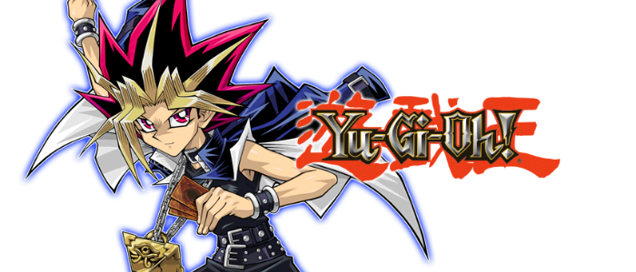

  
  
  

# Project Description

For my second project at General Assembly, I had one week to choose and consume a public API that piqued my interest. After some consideration, I discovered a Yu-Gi-Oh API, a well-known Japanese trading card game. My personal connection to the game stemmed from childhood memories of watching my uncle play Yu-Gi-Oh! Forbidden Memories on the Playstation 1. With this knowledge, I embarked on creating a gacha-style game utilising React, TypeScript, and Bulma. Users can open a card pack and receive three random cards, which they can keep in their inventory.

deployment link: https://yugygacha.netlify.app/

## If you’d like to try the code locally.

1. Clone the repository
2. At the root of the project - npm i
3. To run the code - npm run dev

## Minimal Viable Product

The timeframe allocated for completing my MVP for this project was one week, and I worked on it independently, similar to my first project.

## Technology Used
- React
- Bulma
- TypeScript
- Git
- Github
- Excalidraw

## Project Brief

- Consume a public API – this could be anything but it must make sense for your project.
- The app should include a router - with several "pages".
- Include wireframes - that you designed before building the app.
- Have semantically clean HTML - you make sure you write HTML that makes structural sense rather than thinking about how it might look, which is the job of CSS.
- Be deployed online and accessible to the public.

## Planning

Before delving into the technical details, I find it helpful to have a clear idea of the overall design of the project. To achieve this, I typically start with a visual mockup using tools like Figma or Sketch, but in this case I used Excalidraw.

While working on the application layout, I opted to prioritise its features by utilising a colour-coded system. Specifically, I used green to indicate the most essential features for the minimum viable product, and reserved orange and red to signify features that should only be addressed once all the green features are completed, or as potential future additions.

### Setting up the project

1. Create repository
2. Clone repository into my local machine
3. Setup a react project with TypeScript - npm create vite@latest
4. Install Bulma - npm i Bulma
5. Created all necessary components for the project.
6. Add, Commit and Push changes to Github.

## Coding Process

Although we were provided with pre-made website templates, I was interested in learning how to create a project from the ground up. After researching the available build tools, I determined that React+Vite was the optimal choice due to its fast Hot Module Replacement (HRM) capability. Setting up a React project with Vite was straightforward, requiring only the command above on step 3.

### All cards component
To retrieve all the cards from the Yu-Gi-Oh API, a component was used. The fetch function was enclosed within a useEffect hook to ensure that the data is only fetched once, immediately after the user navigates to that particular page. Subsequently, the obtained data was passed down as props to a separate component named "card".

### Card Component
This particular component is responsible for displaying a solitary card with its corresponding data passed down as a prop. Within this component, I utilised the "id" prop to serve as a parameter for the "Link" component provided by react-router-dom. This was necessary to enable the user to click on the card and be directed to a separate page that displays the full information of the selected card.

### Single Card Component
As previously stated, this component is tasked with displaying an individual card on the page. To ensure that the correct card is fetched when clicked, a "useParams" hook was implemented. This hook enables the component to access the previously passed parameter through the "Link" component from react-router-dom.

### Your Cards component
This component is responsible for displaying the user's cards and also includes the functionality for opening a card pack. To prevent errors, only the first 10 items from the API request are fetched.
The getCardIndex() function generates a random number based on the length of the fetched cards array.
The openPack() function is responsible for generating the randomly selected cards by creating a temporary array and using a for loop to iterate through and randomly select card indices using the getCardIndex() function. The randomCard object is created using the selected index to assign the card's name, image, and rarity properties. The temporary array is then assigned to a state function, which is used to display the cards on the screen.

## Challenges

### 1#
As a newcomer to both React and Bulma, my first project was already a challenge. However, I encountered difficulties when attempting to modify Bulma's design. It proved to be especially tricky to adjust elements such as the navbar gutters or button colours. Despite my best efforts to write my own CSS, I found it to be an even more demanding task than expected.

### 2#
I found that Bulma did not have all the features I needed for my app, such as a tooltip. I attempted to create my own tooltip from scratch, but it turned out to be more challenging than I anticipated. Although I was able to make it work, the tooltip did not behave the way I wanted it to. Specifically, when hovering over the card, the tooltip remained in a fixed position on the page.

### 3#
I was introduced to TypeScript on this project, which proved to be the most challenging language for me, given that I had only worked with JavaScript up to that point. While working on the project, I found myself spending a lot of time grappling with TypeScript types and interfaces that were not functioning as expected. Ultimately, I had to resort to setting numerous variable types as 'any', as it was taking up too much time.

### 4#
While developing the modal that opens the card pack, I nested too many components within one another. This made it challenging to pass card data to the main component, "YourCards". Although the app allowed users to keep selected cards by clicking on them, the cards were being displayed within the modal, which was not my intended outcome. Unfortunately, I reached the last day of the project without finding a solution to this problem.

## Wins

While working with APIs, accessing data can sometimes be straightforward. However, the API I selected had missing properties that could potentially cause my app to break. As shown in the image below, when generating a random card object, I implemented a boolean check using a ternary operator to determine the rarity property. Specifically, the check verified whether a "card_sets" existed. If it did, the existing rarity was used as the value of the property. Otherwise, the value was set to "none".

When mapping the card information to another component, it is advisable to use a key prop to distinguish individual items. However, my app is designed to allow multiple instances of the same card, which technically have the same ID. Thus, I cannot use the IDs provided by the API since they are not unique. Instead, I utilised a uuid function to generate a unique ID each time a card is passed as a prop.

## Key Learnings/Takeaways

Despite the fact that the project didn't turn out as planned, I am proud that I took the initiative to work on features that were not covered in the course, such as creating tooltips and modals, even though they are not fully functional. Considering the limited time I had to learn React, TypeScript, and Bulma, I believe I made significant progress with the project. However, I do wish I had more time to refine the app's appearance and make it more presentable.

Throughout the project, I gained more experience with React, I now feel much more comfortable using it. It's impressive how React allows for building seamless applications that don't require full page reloads. By understanding how to pass data through props from parent to child and vice versa, there are many possibilities for building powerful applications. I also realised that I was experiencing prop drilling, and learned that React Context can be used to solve this issue. I plan to explore React Redux in more detail in the future.

Although I was unable to define all of my TypeScript types and interfaces, I now have a better understanding of their significance in minimising the number of bugs caught during compile time. In my experience, the most valuable aspect of TypeScript is its ability to provide clear and informative linting errors, which help pinpoint issues in the code. I believe that TypeScript will become even more beneficial as I tackle larger and more complex projects.

The key learning from this project was consuming a public API, and I also developed a better understanding of how to work with asynchronous functions, debug and manipulate data responses. Overall, this experience enabled me to create something useful out of the data obtained from the API, which is exciting!

## Bugs

### 1#

As previously mentioned, the tooltip stays fixed on the screen when hovering over a card, which is a CSS issue that I attempted to create myself.

### 2#
When adding an item to my inventory, the card is mistakenly added to the wrong component.

## Future Improvements

- Fix tooltip
- Fix the inventory
- Improve the UI/UX
- Use proper TypeScript instead of setting types to any
- Add filters and a search bar
- Pagination
- Properly save user cards in the local storage
- Be able to remove and sell cards
- Add cards from the all cards page to the user inventory
